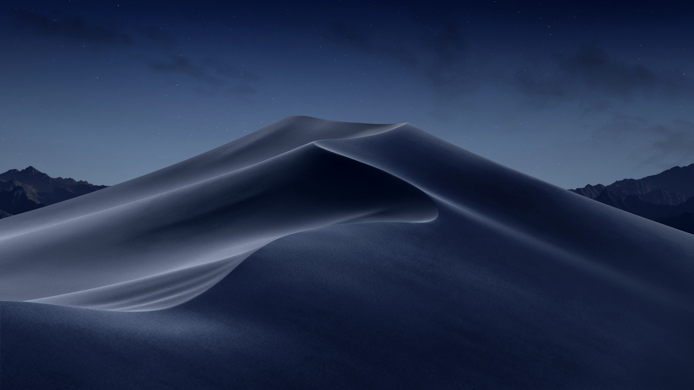

## Installation
### Install Gnome Backgrounds (wallpaper will change according to time)

```sh
sudo ./install-gnome-backgrounds.sh
```

> Options:

```
  -u, --uninstall         Uninstall wallpappers
  -h, --help              Show help
```



